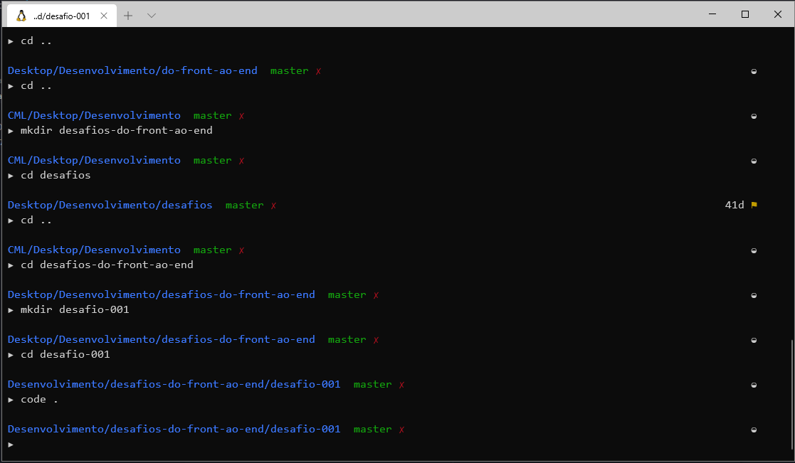

# Resolvendo desafios da aula 01

## Desafios
1. Terminal com outro tema

2. Markdown com outros comandos

3. Mudar a mensagem do ultimo commit

### Desafio 01 - Terminal com outro tema

#### Terminal WSL2 Ubuntu zsh Tema - AVIT

### Desafio 02 - Markdown com outros comandos.

- Utilizado `###, ####` para titulos.
- Utilizado `` Para linkar imagens
- Utilizado `numero. ` para listas ordenadas

#### Desafio 03 - Mudar a mensagem do ultimo commit

- Com o comando `git commit --amend -m` foi alterado a mensagem do ultimo commit realizado.