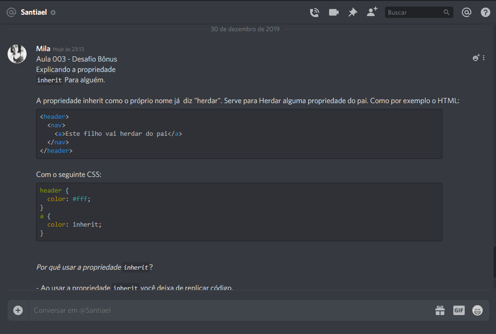
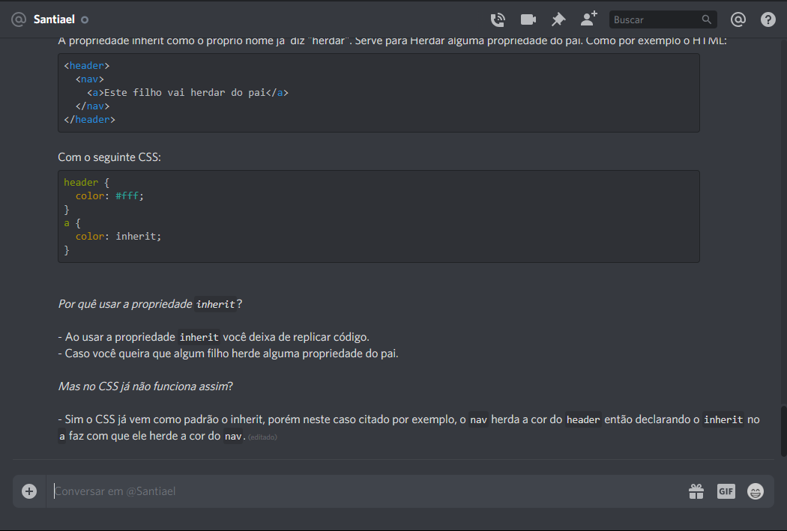

# Resolvendo desafios da aula 03

## Desafios
***
1. Desafio fácil

>Escolher a propriedade e colocar espaçamento entre os itens(Produtos, Serviços, Carrinho)

- Link para o desafio fácil <https://github.com/milafrn/loja-fone/commit/7218fdea8f1844b5623d405c11fea467b6ef5fad>
***
2. Desafio intermediário

>Criar o butão (comprar). OBS: Botão é fora do header

- Link para o desafio intermediário <https://github.com/milafrn/loja-fone/commit/02fcbc2ee7027a2ca7e024866d7a9efa4527ae4a>
***
3. Desafio Avançado

>Centralizar apenas o header verticalmente

- Link para o desafio Avançado <https://github.com/milafrn/loja-fone/commit/ff83438f8071ae176faf13c0e83ef38a649bd08d>
***
4. Desafio Bonus

>Explicar para alguém a propriedade **`Inherit`**

